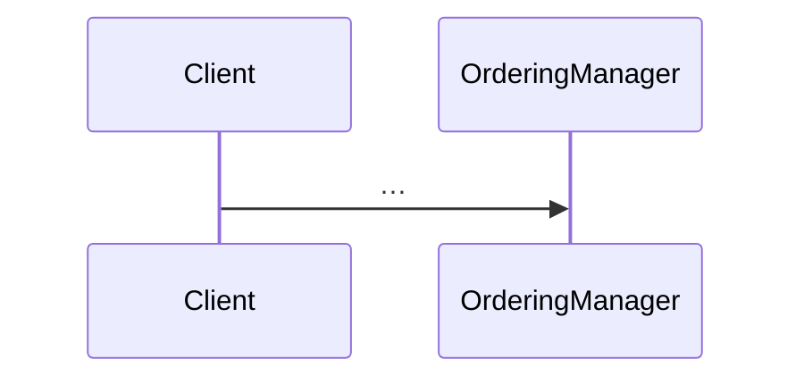

# Architecture formats

```
docs/architecture/
├── NEEDS.md            ← what the architecture must satisfy
├── ARCHITECTURE.md     ← the decomposition, its mapping onto technology, and its validation
└── OPEN-QUESTIONS.md   ← working file: the technology shortlist, the draft, pending questions; deleted at the end of a full run
```

## NEEDS.md

```md
# Needs

What the architecture must satisfy. Technology-agnostic. Verdicts per candidate are folded into the Technology decisions of `ARCHITECTURE.md`, not kept here.

## Must

**{Short name}**: {what must be possible, in domain terms}.
Source: invariant "{name}" | principle "{name}" | baseline pain point | previous attempt

## Want

**{Short name}**: {…}.
Source: …
```

## ARCHITECTURE.md

```md
# Architecture

{Two sentences: the shape of the system and the chosen technology.}

## Core use cases

- **{Name}**: {one line}. Domain workflow: {workflow name}

## Volatilities

- **{Name}** (over time | between users): {what changes}. Encapsulated by: {Component}.

## Components

### {Name}Manager
Volatility: {name}. Owns Commands: {Command}, {Command}.
Contract: {verb}, {verb}, {verb}.

### {Name}Engine
Volatility: {name}.
Contract: {verb}, {verb}, {verb}.

### {Name} (Client | Utility | ResourceAccess | Host | Model)
Volatility (none for a Utility, Host, or Model): {name}. Contract or role: {verb, verb, or one line}.

## Communication rules

{Löwy's rules as they apply here, plus any project-specific additions.}

## Technology

- **{Area}**: {choice}. _Why_: {only if surprising}.
- **Project tasks**: {what `just check` runs; the recipes `check`, `test`, `run`}.
- **Framework boundary**: {which components may depend on the framework, and why}.
- **Unit**: {what a component maps to: package, assembly, module, ...}.
- **Test reference**: {the form a spec uses to name a test, e.g. file and test name}.
- **Enforcement**: {which checks in `just check` enforce the tables below, if any}.

## Rule translation

Only when the framework's data model is the domain model.

| Löwy rule | In {framework} terms | Checked by |
|---|---|---|
| Engines never call Engines | Engine units never depend on each other | {enforced \| review} |
| Managers talk to Managers only through a queue | {…} | review |

"Enforced" means a check that `just check` runs; "review" means the review agent guards it.

## Dependencies

| Unit | Type | May depend on |
|---|---|---|
| ordering_manager | Manager | pricing_engine, order_access, model |
| pricing_engine | Engine | model |
| order_access | ResourceAccess | model |
| model | Model | |
| web_ui | Client | ordering_manager |

Types: Host, Client, Manager, Engine, ResourceAccess, Utility, Model. "Host" is the composition root (the executable that wires every component together); it may depend on anything and holds no logic. "Model" holds shared data contracts (domain types, messages); any unit may depend on it, and it depends only on Utilities. Managers never depend on other Managers: their queued messages are Model types. List only the project's own units; separate entries with commas.

## Restricted external dependencies

| External dependency | Allowed for |
|---|---|
| ui_toolkit | Client |
| database_driver | order_access, Host |

"Allowed for" lists types, unit names, or both.

## Call chains

### {Core use case}


## Future changes

### {Feature}
Fits by: {the operations or rules added to which components}. No restructuring.
```

## Accepted gaps

- {A Need or Want the architecture knowingly does not meet yet, and where it would be met later.}
