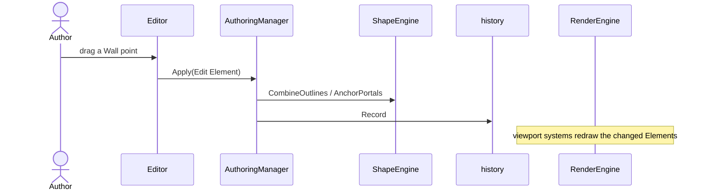
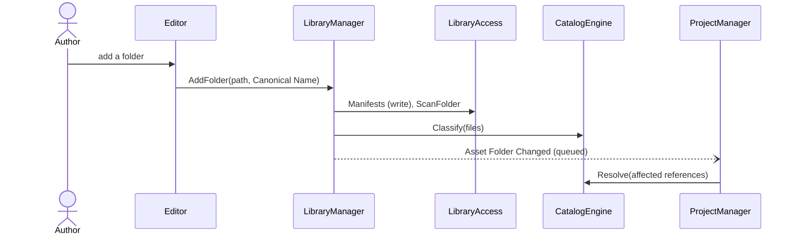
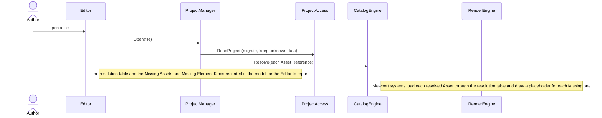
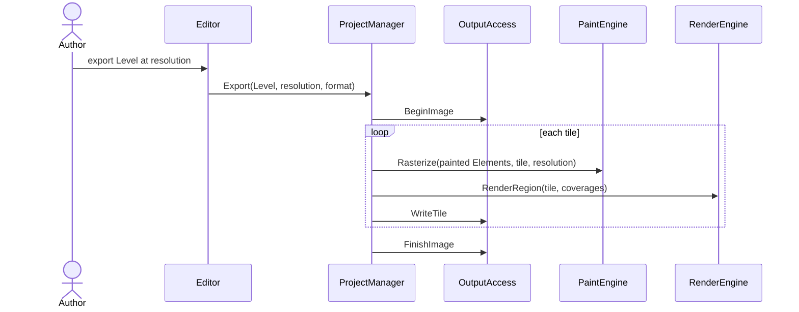

# Architecture

A Bevy 0.20 application whose ECS World is the domain model, decomposed by volatility into three Managers, four Engines, three ResourceAccess components, two Utilities, and an egui Client, each its own crate in a Cargo workspace.

## Core use cases

- **Compose a Level**: place, paint, edit, restack, and remove Elements; Layers, Portals, Prefab Instances; undo. Domain workflow: [Compose a Level](../domain/authoring.md#compose-a-level)
- **Bring in Assets**: Asset Folders, Asset Packs, vendor updates, Indexing Rules. Domain workflow: [Use a new vendor release](../domain/asset-library.md#use-a-new-vendor-release)
- **Open a Project**: resolve Asset References, report Missing Assets and Missing Element Kinds, Relink; sharing is a variation. Domain workflow: [Open a Project on another device](../domain/asset-library.md#open-a-project-on-another-device)
- **Export a Level**: render the Bounds at a chosen resolution. Domain workflow: [Export a Level](../domain/output.md#export-a-level)

## Volatilities

⏳ over time · 👥 between authors

- **Composing sequence** ⏳: how authoring Commands are carried out, grouped for undo, and propagated to Prefab Instances. Encapsulated by: AuthoringManager.
- **Intake sequence** ⏳: how Asset Folders and Asset Packs are brought in and kept current. Encapsulated by: LibraryManager.
- **Project lifecycle** ⏳: how Projects are opened, resolved, relinked, saved, and exported. Encapsulated by: ProjectManager.
- **Geometry rules** ⏳: Walls generated from Rooms and Caves, Portal anchoring, outline operations, snapping. Encapsulated by: ShapeEngine.
- **Painting** ⏳👥: how Brushes lay down, erase, and blend paint. Encapsulated by: PaintEngine.
- **Cataloguing** ⏳👥: which files are Assets and of what kind (Indexing Rules, vendor layouts), and which Asset an Asset Reference means. Encapsulated by: CatalogEngine.
- **Look** 👥⏳: Materials, Shaders, compositing, lighting. Encapsulated by: RenderEngine.
- **Project storage** ⏳: the Project format and its versions. Encapsulated by: ProjectAccess.
- **Asset sources** 👥⏳: where Assets come from (folders, packs, Embedded Assets, Plugin archives, later perhaps online libraries). Encapsulated by: LibraryAccess.
- **Output** ⏳👥: image today; VTT formats later. Encapsulated by: OutputAccess.
- **Extension mechanism** ⏳: Plugin packaging and scripting language. Encapsulated by: PluginAccess (built when Plugins are built).
- **Presentation** 👥: layout, simple and advanced views, the UI toolkit. Encapsulated by: Editor.
- **Element kinds** ⏳👥: new kinds from features and Plugins. Encapsulated by: the Element kind registry in `model`: a kind is a descriptor (schema, shape or paint behaviour, Material), not new code, so adding one never restructures a component.

Not volatilities (bounded variation): the export image format; how the Grid is drawn.

## Components

### AuthoringManager
Volatility: composing sequence. Owns Commands: Add Level, Remove Level, Reorder Levels, Add Layer, Remove Layer, Reorder Layers, Group Layers, Edit Layer, Resize Bounds, Set Ambient Light, Place Element, Edit Element, Remove Element, Restack, Paint, Set Portal into Wall, Free Portal, Place Prefab, Sync Prefab Instance, Detach Prefab Instance, Update Prefab.
Contract: Apply (an authoring Command), Undo, Redo.

### LibraryManager
Volatility: intake sequence. Owns Commands: Add Asset Folder, Remove Asset Folder, Rename Canonical Name, Install Asset Pack.
Contract: AddFolder, RemoveFolder, RenameFolder, InstallPack, Refresh, Browse (answer the browser's search text and the Assets whose thumbnails it wants). _Why_: the Editor may not reach CatalogEngine or LibraryAccess, so the browser's questions about the library go to the Manager that owns the intake; one more operation than Löwy's five keeps every Asset Folder concern in one place.

### ProjectManager
Volatility: Project lifecycle. Owns Commands: Relink, Embed Asset, Export Level.
Contract: Open, Save, Relink, Embed, Export.

### ShapeEngine
Volatility: geometry rules.
Contract: CombineOutlines, GenerateWalls, SplitWall, AnchorPortals, Snap.

### PaintEngine
Volatility: painting.
Contract: ApplyStroke, BlendWeights, Rasterize.

### CatalogEngine
Volatility: cataloguing.
Contract: Classify, Resolve (including Canonical Name equality), Suggest, Search.

### RenderEngine
Volatility: look.
Contract: CompileMaterial, RenderRegion, and the viewport projection (scheduled systems that draw the model).

### ProjectAccess
Volatility: Project storage.
Contract: ReadProject, WriteProject, ReadEmbedded, StoreEmbedded.

### LibraryAccess
Volatility: Asset sources.
Contract: ScanFolder, LoadAsset, InstallArchive, Manifests (read, write, forget), Thumbnail.

### OutputAccess
Volatility: output.
Contract: BeginImage, WriteTile, FinishImage.

### PluginAccess (later)
Volatility: extension mechanism.
Contract: InstallPlugin, LoadContributions, RunScript.

### Editor (Client)
Volatility: presentation. The only crate that faces the Author: panels read the World and emit Commands; they never own domain state. It owns the presentation state in `model` (the Viewport): panning and zooming write it, nothing else does.

### history (Utility)
A domain-agnostic stack of reversible commands over a World: Record, Group, Undo, Redo. Every Manager records into it.

### diagnostics (Utility)
How a fault reaches the Author and the contributor: logging to daily files in the editor's own directories, a crash handler that leaves a report and announces it in a dialog, and the location of the editor's Bundled Files by platform layout. StartLogging, InstallCrashHandler, LocateBundledFiles, RevealLogs. It uses no Bevy: the Host wires it before the App exists, and the Editor calls it to reveal the logs and to announce a pending crash report. _Why_ it may show a dialog: a crash dialog may be needed before the Editor exists, so this is the one place a dialog is shown outside the Client.

### model (shared contracts)
Domain components (Project, Level, Layer, Element kinds, `ElementId`, Asset Reference), the Element kind registry, Commands, the messages Managers exchange, and the presentation state the Editor owns (the Viewport: the cell at the centre of the view, the zoom, and the area it is shown in). _Why_ the Viewport lives here: RenderEngine's projection follows it and the Editor steers it, and the Editor may not depend on RenderEngine, so the shared type sits in `model` like every other shared contract.

### app (Host)
Registers every plugin. Holds no logic.

## Communication rules

Löwy's rules ([LOWY-RULES.md](../../.claude/skills/architect/LOWY-RULES.md)), plus:

- The Editor sends each Command to exactly one Manager, as a message.
- Managers call Engines and ResourceAccess directly (plain functions or system parameters), never through messages.
- Managers never call each other; they exchange queued messages whose types live in `model`. Domain event *Asset Folder Changed* is a message from LibraryManager to ProjectManager, which re-resolves the affected Asset References.
- RenderEngine's viewport systems read the model through change detection; nothing calls them per frame.
- Every component type in `model` is written only by the systems of the crate that owns it; everyone else reads. The one exception is the Project lifecycle: ProjectManager materialises every component when it opens a Project and serialises every component when it saves one, through the serialisation registry in `model`. _Why_: Open and Save must rebuild and record the whole World, and Managers never call each other.
- Elements are addressed by `ElementId`, a stable identity that survives saving and loading, never by the ECS entity handle.

## Technology

- **Toolchain**: Rust 1.98.1, minimum supported version 1.96 (Bevy 0.20's floor), edition 2024.
- **Unit**: a component maps to a crate.
- **Test reference**: a spec names a test as `path/to/file.rs::test_fn`, with the module path in between for a test inside a module (`path/to/file.rs::tests::test_fn`).
- **Workspace**: every crate is `drs-<component>` (e.g. `drs-model`, `drs-authoring-manager`) in a flat `crates/*`, taking metadata, dependencies, and lints from the workspace root. Every crate has a `default` and a `dev` feature; `dev` propagates to its workspace dependencies and switches on debug tooling (Bevy's dev collection, dynamic linking in the Host), and each crate's README documents its features. A check enforces this. No translations for now.
- **Project tasks**: a `justfile` is the single entry point; the skills run `just check` (the whole gate, exactly what CI runs), `just test`, and `just run`. `just check` runs: rustfmt, clippy with the workspace lints on Windows, macOS, and Linux, nextest on all three plus `cargo test --doc` (nextest skips doc tests), cargo-deny (also on a weekly schedule), cargo-machete, typos (Oxford English), committed (Conventional Commits), the feature check, the bundle marker check, a check that every guideline's example still appears in its exemplar, a check that every Bevy crate a workspace crate uses is either restricted below or one of the narrow crates, an Engine events check, and an architecture check that enforces the Dependencies tables below against the workspace (all in the `ci` tool under `tools/`), an MSRV build, and a docs build. Public items require docs; private items don't. `CLAUDE.md` holds the AI instructions.
- **Enforcement**: `just check` enforces the Dependencies and Restricted external dependencies tables, the narrow crates of the Framework boundary, and the rows marked enforced in Rule translation (the `ci` tool reads the tables and the Engine crates' sources); for every row marked review, the standards review is the only guard.
- **Profiles**: `dev` builds our crates at `opt-level = 1` and dependencies at 3; `fast`, which `just lint` and `just test` use on Linux and macOS, builds everything at `opt-level = 0` except CatalogEngine at 1 and `memchr`, `caseless`, and `unicode-normalization` at 3, as `dev` builds them; `release` uses thin LTO and `codegen-units = 1`; `dynamic_linking` is enabled in `dev` only. _Why_: Bevy is unusable at opt-level 0, and an opt-0 CI profile broke on Windows under dynamic linking; the search's time bound is a property of a build the Author runs, and unoptimised, a `memchr` scan of 400,000 names costs 137 ms and folding them takes building the search past two seconds.
- **Lints**: `unsafe_code` is forbidden; clippy `pedantic` at warn with `priority = -1`; `unwrap_used`, `expect_used`, `panic`, `todo`, and `unimplemented` are denied outside tests; `wildcard_enum_match_arm` is denied; `allow_attributes_without_reason` requires `#[expect(.., reason)]`; `World::resource` and `World::resource_mut` are `disallowed-methods`, so a missing resource goes through `get_resource` and becomes a report; `std::env::set_current_dir` is a disallowed method too, so the working directory never matters to the editor; `print_stdout` and `print_stderr` warn outside tests, so the terminal is written to only where an `#[expect(.., reason)]` says why, which is before logging exists; `needless_pass_by_value` is allowed, because a Bevy system takes its parameters by value. CI denies warnings through `CARGO_BUILD_WARNINGS=deny`, not `RUSTFLAGS`, which invalidates the Bevy build cache. _Why_: a bad file must become a report, never a crash (References are never dropped), and the wildcard lint guards dispatch over Element kinds, Commands, and Project versions.
- **Supply chain**: `deny.toml` is based on Bevy 0.20's, with `wildcards = "deny"`, crates.io as the only source, `multiple-versions = "warn"`, MPL-2.0 granted per crate rather than globally, and `derive_more/error` banned in favour of thiserror. Our crates carry an SPDX `license`; third-party licences are generated from the same allow-list.
- **Deterministic saves**: `clippy::iter_over_hash_type` is denied workspace-wide. _Why_: hash-map iteration order would make the same Project save differently between runs.
- **Deterministic output**: Export and golden-image tests are bit-identical across machines, so `f32::algebraic_*` and the platform's `sin`/`powf` are avoided in favour of `bevy_math::ops`, enforced through clippy `disallowed-methods`. `bevy_math::ops` is machine-independent only with `bevy_math`'s `libm` feature, which the workspace enables on `bevy_math` and on the umbrella `bevy` alike. _Why_: fast-math and per-platform libm differ between machines; without `libm`, `bevy_math::ops` calls the platform's functions.
- **Engine**: Bevy 0.20, pinned to `=0.20.0-rc.2` until 0.20.0 ships. _Why_: the only candidate that is an ECS, renders on Metal/Vulkan/DirectX 12, and passed every rendering spike. Bevy is used with `default-features = false` plus `2d_bevy_render`, `default_app`, `std`, `multi_threaded`, `bevy_winit`, `x11`, `wayland`, `gestures`, and the image formats `png`, `jpeg`, and `webp`. _Why_ not the `2d` collection: it pulls in the default platform set, and with it gamepad support, the clipboard, and system information an editor does not need, and left Linux windowing to transitive defaults; `x11` and `wayland` are therefore enabled explicitly, and `gestures` gives the trackpad pinch.
- **UI**: egui through bevy_egui, with egui_dock, egui_ltreeview, and rfd, confined to the Editor crate. _Why_: feathers lacks tree, docking, and virtual lists today; the Editor crate can switch to feathers panel by panel once it has them. Spiked and pinned: bevy_egui 0.43.0-rc.1, egui 0.36.2, egui_dock 0.21.1, egui_ltreeview 0.9.0, rfd 0.17. Each Bevy upgrade waits for bevy_egui, then egui, then egui_dock and egui_ltreeview (the last two have small maintainer sets), so upgrades are deliberate and all egui code stays in one crate. Map Labels render in Bevy, not egui (egui's complex-script shaping is weaker). Bevy images are registered with egui through `EguiContexts::add_image`; `EguiContexts` and `ResMut<EguiUserTextures>` in one system conflict at runtime (Bevy's B0002). The advanced reflection view is driven from `Reflect` ourselves, as bevy-inspector-egui targets an older Bevy. Rejected: egui_tiles (less mature than egui_dock), jackdaw crates as dependencies (internal, older Bevy; design references only), Slint, iced, and Tauri (no direct World access).
- **Model layers we own**: the command history (`history`), the Project format (ProjectAccess, versioned per component, unknown data passed through), the Asset index and search (CatalogEngine and LibraryAccess), and painted regions as stroke lists with a tiled pixel cache (PaintEngine).
- **History**: Commands are command objects keyed by `ElementId`; two generic reflection-based commands cover the rest (Remove Element snapshots every reflected component; SetField swaps a value by reflect path, so property panels get undo for free); a Paint command keeps only its own stroke. _Why_: measured on a 2,000-stroke Terrain, a reflection diff kept 25 MB and took 12.8 ms for two strokes, against 3 KB and 25 µs.
- **Project format**: stable component names chosen by each crate, per-component schema versions with migrations, unknown components written back verbatim. _Why_: Bevy's `DynamicWorld` writes Rust type paths and raw entity bits (moving a type breaks saved files) and silently skips components without reflection registration, which would break References are never dropped; BSN has no file format in 0.20. The model holds a format-agnostic `ProjectSnapshot` (the Project's envelopes, its Levels and Layers in order, its Elements by identity), which ProjectManager gathers on Save and materialises on Open; ProjectAccess alone maps the snapshot to and from the file's shape and version. _Why_: the snapshot is the model's view of a whole Project and the file is ProjectAccess's volatility, so a new format version or container changes one crate and no Manager.
- **Asset identity**: a Project holds a lockfile-style table with one row per distinct Asset (folder key, every normalized relative path the Asset is known to sit at, the first being where it was placed, display name, kind, fingerprint of BLAKE3 content hash with one fixed `blake3:` recipe, byte size, pixel size) and one row per Asset Folder (id if known, name, version); Elements hold only a Project-local row number, and pixel size lets a placeholder keep its layout. Paths are stored NFC with `/` separators, original spelling kept for display. _Why_: path-only identity breaks on vendor renames; hash-only breaks on every touched-up re-export and needs the whole library hashed first (about 46 GB); editor-minted per-file ids need writes into vendor folders and differ per device; a curated community catalogue is unaffordable at 3–5 releases a month (it stays possible later as an optional layer). The Manifest therefore carries no per-file ids or hashes.
- **Resolving an Asset Reference**: stops at the first certain match, in this order: exact path, case- and Unicode-insensitive path, Manifest redirects, identical bytes anywhere (hashing only files whose size equals the recorded size), then a format twin. Anything weaker is a suggestion the Author confirms; filename-only matches are never accepted automatically, and two files differing only in case are asked about, never guessed. _Why_: cross-OS case and Unicode differences (APFS/NTFS against ext4); a plausible wrong Prop is worse than a prompt.
- **Asset index and caches**: startup does a stat-only parallel walk (about 1 s for 400k files) diffed against a per-folder index cache kept in the app cache directory, never in a vendor folder, and hashes nothing. Anything that opens every file (hashing, header sniffing, perceptual hashing) is a background or on-demand job; content hashes are computed at placement or when resolving. Thumbnails are generated in the background, visible rows first, into one append-only pack file plus a fixed-record index (32 B per entry, including a 16-byte digest of the key, so a record names its own thumbnail and a torn or reused record is skipped; 400k entries are 12.8 MB), keyed by folder key, path, size, and mtime and read with positional reads, never mmap. The browser lays out only the visible rows, decodes thumbnails off the main thread through a second asset source (`thumb://`) registered before `AssetPlugin` like `lib://`, so decoding runs in the asset system's load tasks (about 16 µs wall per 128² JPEG on four threads) with a prefetch of two rows either side, registers an egui texture only while a thumbnail is visible and unregisters it when it leaves, and bounds GPU memory with an LRU of strong image handles: dropping the last handle frees the texture the same frame, while unregistering from egui alone frees nothing. _Why_: merely opening 400k files costs 5–41 s, and hashing on a slow disk or an online-only cloud folder means minutes or a full download; resident pack pages under mmap inflate memory; decoding on the main thread costs 5–22 ms per frame at 60 Hz; every registered egui texture costs a bind group per frame on Metal; the Editor may not depend on LibraryAccess, so the asset server is its only way to a thumbnail's bytes; and a digest in each record leaves the per-folder index cache untouched while thumbnails are generated, so a crash cannot leave it pointing at a reused record. Measured: scrolling at 1–20 rows per frame and a scrollbar drag over 66,667 rows keep the main-world work under 1 ms per frame with 55 bind groups. A hash says same or different, never newer or older. Names need no Tantivy and no fst: a substring scan with `memchr` over each folder's folded names runs in about 1 ms for 400k names, and it tells where in a name a hit falls, which ranking needs.
- **Runtime Asset Folders**: Bevy asset sources freeze when `AssetPlugin` is built, so all Asset Folders go through one dynamic source (`lib://<folder-key>/<path>`) whose reader looks the key up in a table changed at runtime and rejects `..`; `.meta` lookups are off (`AssetMetaCheck::Never`), Bevy's asset processor is never used for Asset Folders, `AssetId` and `Handle` are never persisted, and the headless `ImageLoader` is registered manually. _Why_: the processor reads and duplicates every file on each run (about 46 GB), and `.meta` costs an extra open per Asset. The editor never writes into an Asset Folder on its own, as folders may be read-only, synced, or overwritten by releases.
- **Folder watching (a Want)**: Bevy watchers are fixed at build time, so a dynamic source needs our own `notify` watcher per Asset Folder feeding the index diff and `AssetServer::reload`, debounced because vendor sync tools can produce event storms.
- **Shader contract**: author Shaders are plain WGSL with no Bevy imports: a `Params` struct in a 256-byte uniform (group 2, binding 0) plus one texture and one sampler. Params are reflected with naga (this drives the property panel), and a Shader is validated with naga before Bevy sees it, keeping the last good handle. _Why_: Bevy 0.20 moved its own shaders to WESL and renamed import paths, so the engine publishes its own small stable prelude, re-tested on each Bevy upgrade. Arbitrary bind-group layouts would need our own pipeline (medium effort).
- **Layer compositing**: ping-pong. Each Layer renders into a scratch texture and a full-screen pass mixes it into the alternate backdrop, so three textures serve any number of Layers; order comes from `Camera.order`, and later cameras on the same target set `output_mode` Write with `BlendState::REPLACE` (Bevy 0.20 alpha-blends them by default). Blend maths runs on sRGB-encoded values, the image-editor convention (matched a CPU reference within 1/255). Not built: Layer Groups (isolated buffer), non-opaque backdrops (full W3C formula), and the cost of two cameras per Layer (about 60 passes at 30 Layers; merge runs of normal Layers or use one custom render node).
- **Terrain blending**: one masked draw per Material, each with its own Shader, multiplied by an editable per-Material weight mask (tiled textures); cost scales with the Materials visible. _Why_: a single pass storing the top four indices and weights per texel is faster but forces every Terrain Material to share one Shader. Not spiked.
- **Export**: fixed-size tiles from one offscreen camera, each read back and streamed into a PNG writer (20,000 × 20,000 px on a 16,384 px GPU in 5.8 s and 740 MB). This is why OutputAccess writes an image in parts (begin, write tile, finish). Capturing waits for pipelines and Assets to be ready. The `image` crate's WebP encoder is lossless only.
- **Labels**: Bevy 0.20 text rasterizes glyphs at `font_size` in pixels and is not scaled by the camera, so zoom and export scale `font_size` up and the entity scale down, costing an atlas per size.
- **Painting**: an erase is a stroke, so it can be deleted or reshaped later; strokes composite in order and coverage is the maximum over segments (no dab build-up); an erase lowers the mask to the minimum of its value and one minus the erase's coverage, so paint and erase are one pass each. _Why_: a per-segment multiplicative erase builds up at joints (measured up to 64/255 off), while the minimum is exact in one pass. The CPU rasterizer stays the golden reference for headless export and tests. Editing rasterizes on the GPU inside PaintEngine: mask tiles (512 px, R8) are plain render-world images, and a render-graph pass per dirty tile clears it and draws one instanced capsule quad per stroke segment with a maximum blend for paint and a minimum blend for erase. _Why_: spiked on Bevy 0.20 and an M4 Max: one new 40-segment stroke into a 4096² mask costs under 0.3 ms against 120–175 ms on the CPU at 128 px per cell, recomputing 200 strokes costs 1.3–14 ms depending on radius (2.6 ms when only the touched tiles recompute), and the per-pixel loop over all segments (fragment or compute) costs 60–83 ms, so only the capsule-quad path qualifies. Draw calls cost about 3 µs each, so tiles are 512 px and runs of same-kind strokes share a draw. The tiled pixel cache is private to PaintEngine: one cache per Terrain Material, keyed (band, tile x, tile y) in the Level's pixel plane, lazily allocated (an absent tile is empty) and independent of the Bounds (strokes outside land in negative-keyed tiles). It holds a resident base at 32 px per cell for the whole Level (a 60 × 60 cell Level is 16 tiles, 4 MiB per Material) plus view-following overlays at 64, 128, and 256 px per cell; the active band is the largest power of two not above the zoom, so it is magnified at most 2× and never minified, with 10 % hysteresis. _Why_: measured on an M4 Max, a band switch over a 4096² view costs 6–8 ms of GPU work for at most 81 tiles, while the next-band-up rule costs 19–27 ms for up to 256 tiles, re-rasterising every zoom frame costs 5 ms per frame, and without hysteresis a ±6 % zoom wobble flips bands every six frames; edits cost 0.3–1.1 ms for a new stroke and 0.6–1.8 ms to re-edit an old one, and magnifying the 32 px base 2× is indistinguishable for soft brushes and a 3 px ramp for hard ones. Rasterize stays one operation (strokes, region in cells, px per cell, target) serving cache tiles and export tiles alike; RenderEngine receives one image handle and rectangle per visible tile of the active band and draws the masked Material unchanged. Not spiked: other GPUs and platforms, export through the GPU path.
- **Geometry**: i_overlay, kurbo, and lyon_tessellation inside ShapeEngine; ShapeEngine strokes Walls into meshes with its own code, round joins and caps computed with no trigonometry, through correctly rounded square roots only, and lyon_tessellation only fills outlines, because lyon's round joins and caps call the platform's `cos`, `sin`, and `acos` and would make Exports differ between machines. _Why_: Rooms and Caves keep their editable source outlines (curves included) as the truth and derive the combined outline, cached, so control points stay editable through a union (a destructive boolean would bake curves into segments; recompute after a control-point drag took 13 µs). Room outlines combine through i_overlay's `EdgeOverlay` (integer-only, behind our own adapter): under union, difference, and intersection every output edge is a piece (Room, edge, t0..t1) of exactly one input edge; curved edges are flattened for the boolean and rebuilt exactly as sub-segments of the source curves (kurbo's `flatten` puts vertices up to 0.036 off the cubic, so t is recovered with `nearest`). Party walls, the coincident edges of adjacent Rooms, are kept from the cancelled coincident records and clipped to the derived outline, so a door between two Rooms survives; this needs exact coincidence, which Snap provides. Portal anchoring is our own code over that provenance: a Portal anchors as (Wall or Room `ElementId`, segment or edge index, t along it, side), never by arc length, and a Portal whose piece of Wall vanishes is removed by the outline-changing Command in the same undo group (Free Portal stays the Author's explicit Command). _Why_ (segment, t): an upstream point drag moves an arc-length anchor 0.1–2.4 units and a (segment, t) anchor not at all. A full recompute of 20 Rooms with two cubic edges each, 10 Portals, and 16 party walls costs 0.3–0.4 ms.
- **Lighting**: deferred (a Want); re-evaluate when built, starting from bevy_firefly. _Why_: it is the only maintained crate with polyline occluders, soft shadows, and headless image targets; it lags each Bevy release (no 0.20 release yet; fallback is vendoring it). bevy_light_2d has rectangle occluders only, bevy_magic_light_2d is abandoned, and a custom CPU visibility polygon took 1.37 s per frame at 2,134 segments and leaked light at joints. Its config panics with more than one camera carrying it, and its light map is sized to the view, so lighting under tiled export is untested.
- **Scripting**: deferred (a Want); candidates Luau via mlua, then Rhai.
- **Framework boundary**: the ECS is the model, so every crate may use the narrow ECS crates (`bevy_ecs`, `bevy_reflect`, `bevy_math`, `bevy_app`, `bevy_tasks`). _Why_ `bevy_tasks`: the future type an asset reader returns lives there, so a crate that implements one needs it. Only the Editor and the Host use the umbrella `bevy` crate; only RenderEngine, PaintEngine, the Editor, and the Host use the render stack; only LibraryAccess, RenderEngine, the Editor, and the Host use the asset system; CatalogEngine, OutputAccess, and diagnostics use no Bevy at all. Every other Bevy crate is a deliberate choice: the `ci` tool refuses a `bevy_*` crate that is neither in the parenthesised list of narrow crates above nor a row of the Restricted external dependencies table.

## Rule translation

| Löwy rule | In Bevy terms | Checked by |
|---|---|---|
| Closed layering: call only downward | Direction of crate dependencies | enforced |
| Only Clients face the Author | UI crates restricted to the Editor | enforced |
| Engines never call Engines | Engine crates never depend on each other | enforced |
| Engines never publish or subscribe to events | Engine crates define and use no events, messages, or observers | enforced |
| ResourceAccess never calls ResourceAccess | No dependencies between ResourceAccess crates | enforced |
| Managers talk to Managers only through a queue | No Manager depends on another Manager (enforced); the messages are queued `model` types (review) | enforced + review |
| A Client calls at most one Manager per use case | Each Command message is handled by exactly one Manager | review |
| Calls to Engines and ResourceAccess are never queued | Managers call them directly | review |
| Contracts are business verbs, 3–5 operations | Each crate's public API is its contract | review |
| Each service owns its business objects | Each `model` component type is written only by its owning crate | review |
| The Host holds no logic | `app` only registers plugins | review |

## Dependencies

| Unit (crate) | Type | May depend on |
|---|---|---|
| drs-app | Host | drs-editor, drs-authoring-manager, drs-library-manager, drs-project-manager, drs-shape-engine, drs-paint-engine, drs-catalog-engine, drs-render-engine, drs-project-access, drs-library-access, drs-output-access, drs-history, drs-diagnostics, drs-model |
| drs-editor | Client | drs-authoring-manager, drs-library-manager, drs-project-manager, drs-history, drs-diagnostics, drs-model |
| drs-authoring-manager | Manager | drs-shape-engine, drs-paint-engine, drs-project-access, drs-library-access, drs-history, drs-model |
| drs-library-manager | Manager | drs-catalog-engine, drs-library-access, drs-history, drs-model |
| drs-project-manager | Manager | drs-catalog-engine, drs-render-engine, drs-paint-engine, drs-project-access, drs-library-access, drs-output-access, drs-history, drs-model |
| drs-shape-engine | Engine | drs-model |
| drs-paint-engine | Engine | drs-model |
| drs-catalog-engine | Engine | drs-model |
| drs-render-engine | Engine | drs-library-access, drs-model |
| drs-project-access | ResourceAccess | drs-model |
| drs-library-access | ResourceAccess | drs-model |
| drs-output-access | ResourceAccess | drs-model |
| drs-history | Utility | |
| drs-diagnostics | Utility | |
| drs-model | Model | drs-history |

PluginAccess (`drs-plugin-access`) joins the table when it is built.

## Restricted external dependencies

| External crate | Allowed for |
|---|---|
| bevy | Client, Host |
| bevy_egui | Client |
| egui | Client |
| egui_dock | Client |
| egui_ltreeview | Client |
| rfd | Client, drs-diagnostics |
| bevy_render | drs-render-engine, drs-paint-engine, Client, Host |
| bevy_sprite | drs-render-engine, Client, Host |
| bevy_sprite_render | drs-render-engine, drs-paint-engine, Client, Host |
| bevy_mesh | drs-render-engine, drs-paint-engine, Client, Host |
| bevy_shader | drs-render-engine, drs-paint-engine, Client, Host |
| bevy_text | drs-render-engine, Client, Host |
| bevy_asset | drs-library-access, drs-render-engine, Client, Host |
| bevy_camera | drs-render-engine, drs-paint-engine, Client, Host |
| bevy_image | drs-render-engine, drs-paint-engine, Client, Host |
| bevy_transform | drs-render-engine, drs-paint-engine, Client, Host |
| bevy_color | drs-render-engine, drs-paint-engine, Client, Host |
| i_overlay | drs-shape-engine |
| kurbo | drs-shape-engine |
| lyon_tessellation | drs-shape-engine |

## Call chains

### Compose a Level


### Bring in Assets


### Browse the library
```mermaid
sequenceDiagram
  actor Author
  Author->>Editor: type in the browser, scroll the grid
  Editor->>LibraryManager: Browse(search text, wanted thumbnails)
  LibraryManager->>CatalogEngine: Search(text)
  LibraryManager->>LibraryAccess: Thumbnail(wanted, visible first)
  Note over Editor: matches and thumbnails come back through model; images load through the thumb:// source
```

### Open a Project


### Export a Level


## Future changes

### Universal VTT export
Fits by: a VTT writer in OutputAccess; a format option on ProjectManager's Export; Walls, Portals, and Lights read from `model`. No restructuring.

### A Plugin adds an Element kind
Fits by: PluginAccess (already planned) registers a kind descriptor in `model`'s registry; ShapeEngine or PaintEngine edits it through the primitives the descriptor names; RenderEngine draws it through its generic mesh-plus-Material path; ProjectAccess stores it by schema, and passes it through untouched when the Plugin is missing (Missing Element Kind). No restructuring.

### 2D lighting with shadows
Fits by: lighting inside RenderEngine (starting from bevy_firefly); an Occluders operation on ShapeEngine derived from Walls and light-blocking Elements; a Light kind descriptor. No restructuring.

### Switching the UI to feathers
Fits by: replacing panels inside the Editor crate one at a time. Nothing below the Client changes.

### A new source of Assets (e.g. a vendor's online library)
Fits by: a new source in LibraryAccess; CatalogEngine classifies and resolves as before; LibraryManager gains a Command for it. No restructuring.

## Accepted gaps

- WebP exports are limited to 16,383 px per side by the format.
- Dropping files from the operating system does nothing on native Wayland (ignored for now): winit 0.30 emits no dropped-file event there; winit 0.31 (beta) fixes it, and XWayland is the workaround.
- 2D lighting is deferred.
- GPU stroke rasterization and the mask tile bands are measured on one Apple M4 Max only; weaker GPUs and Vulkan or DirectX 12 are unmeasured, draw counts beyond 200 strokes are unmeasured, and Bevy applies no GPU back-pressure (slow frames queue silently).
- Mask tile caches cost per Material: six visible Materials hold about 144 MiB of overlays and pay the band switch six times. Budgeting recomputes per frame and evicting hidden Materials come later, inside PaintEngine.
- Thumbnail scrolling is measured on Metal with a warm disk only; cold-disk reads are unmeasured, and a PNG thumbnail (needed for cut-outs) costs 84 µs and 30 KB against the JPEG figures.
- Party walls are verified for two coincident Room edges; three or more coincident sources are unverified.
- 100k fully visible Props needs level-of-detail or batching (later, inside RenderEngine). Performance figures so far come from one Apple M4 Max (10k Props about 2.5 ms, 100k Props 12–16 ms with p95 up to 50 ms); Windows, Linux, and weaker GPUs are unmeasured.
